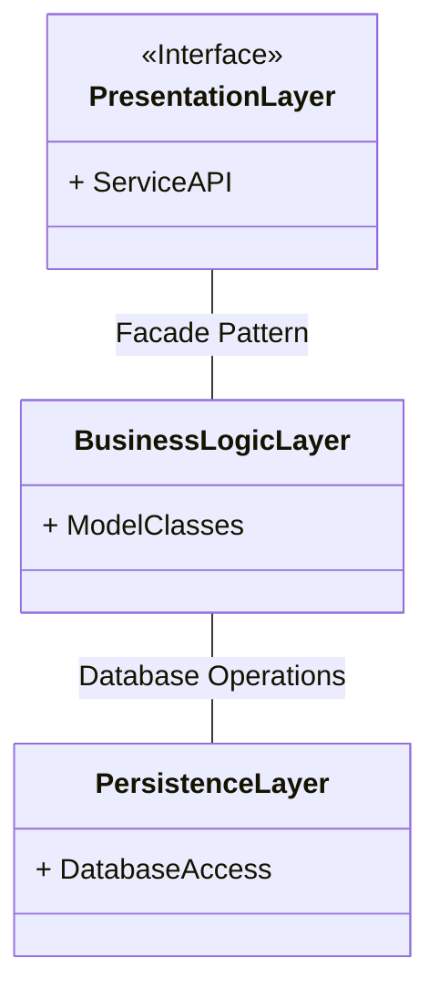

# holbertonschool-hbnb

## AirBnB Clone Project

A comprehensive web application that replicates the core functionalities of AirBnB. This project demonstrates a full-stack implementation using a layered architecture approach.

### Architecture Overview

The application follows a three-tier architecture:

### Core Functionalities

#### User Registration Flow

#### Place Management
- **Place Creation:**

- **Place Listing:**

- **Review Submission:**

### Data Model

The application's data structure is represented in the following class diagram:

### Technologies Used
To be completed

### Installation
To be completed