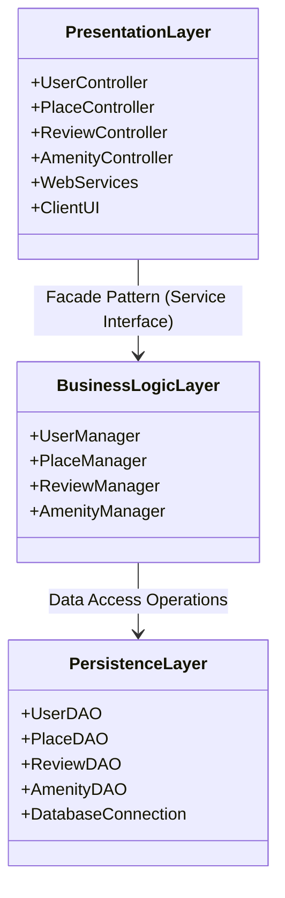
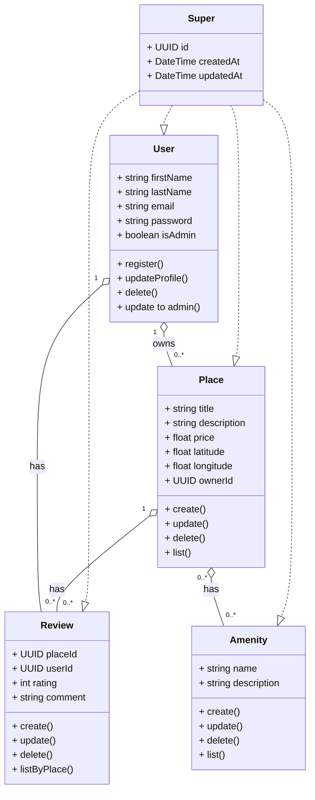
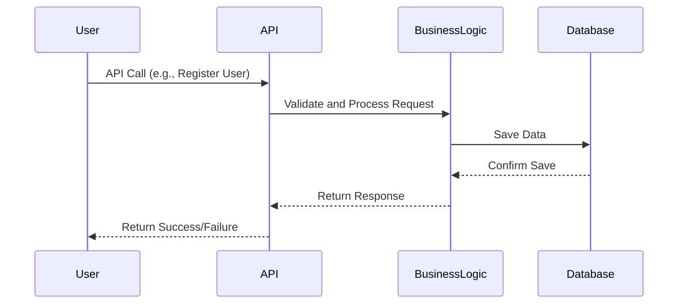

## AirBnB Clone Project

A comprehensive web application that replicates the core functionalities of AirBnB. This project demonstrates a full-stack implementation using a layered architecture approach.
This document presents the project to develop a housing location platform inspired by the Airbnb site. The goal is to design an application that allows users to publish, search and book accommodation intuitively and securely.
# Files
- [ClassDiagram.mmd](https://github.com/Maniok19/holbertonschool-hbnb/blob/main/ClassDiagram.mmd "ClassDiagram.mmd")
- [PackageDiagram.mmd](https://github.com/Maniok19/holbertonschool-hbnb/blob/main/PackageDiagram.mmd "PackageDiagram.mmd")
- 
- [README.md](https://github.com/Maniok19/holbertonschool-hbnb/blob/main/README.md "README.md")
- [SequenceDiagramUserRegistration.mmd](https://github.com/Maniok19/holbertonschool-hbnb/blob/main/SequenceDiagramUserRegistration.mmd "SequenceDiagramUserRegistration.mmd")

## AirBnB Clone Project

A comprehensive web application that replicates the core functionalities of AirBnB. This project demonstrates a full-stack implementation using a layered architecture approach.

### Architecture Overview

The application follows a three-tier architecture:

### Data Model

The application's data structure is represented in the following class diagram:

### Technologies Used
To be completed

### Installation
To be completed

### Core Functionalities
#### User Registration Flow

#### Place Management
- **Place Creation:**

- **Place Listing:**

- **Review Submission:**

### Data Model

The application's data structure is represented in the following class diagram:

# Authors
Esteban Cratere
Mano Delcourt 
Herve Le Guennec