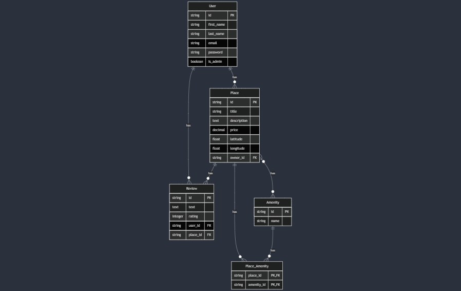

# HBnB - Holberton Airbnb Clone


## Table of Contents
- [Overview](#overview)
- [Features](#features)
- [Database Schema](#database-schema)
- [API Endpoints](#api-endpoints)
- [Installation](#installation)
- [Configuration](#configuration)
- [Usage](#usage)
- [Testing](#testing)
- [Technologies Used](#technologies-used)

## Overview
HBnB is a full-stack web application inspired by Airbnb, enabling users to list, discover, and book accommodations. This project provides a RESTful API using Flask and SQLAlchemy for managing users, places, amenities, and reviews.

## Features
- **User Management**: Registration, authentication, and profile management
- **Places Management**: Create, update, and search for accommodations
- **Reviews System**: Post and manage reviews for places
- **Amenities Management**: Associate amenities with places

## Database Schema
The application uses a relational database with the following entities:



### Main Entities:
- **User**: Manages user accounts (owners and guests)
- **Place**: Represents accommodations
- **Review**: Contains user reviews of places
- **Amenity**: Features available at accommodations
- **Place_Amenity**: Junction table for the many-to-many relationship between places and amenities

## API Endpoints

### Users
- `GET /api/v1/users`: List all users
- `GET /api/v1/users/<user_id>`: Get user by ID
- `POST /api/v1/users`: Create a new user
- `PUT /api/v1/users/<user_id>`: Update a user
- `DELETE /api/v1/users/<user_id>`: Delete a user

### Places
- `GET /api/v1/places`: List all places
- `GET /api/v1/places/<place_id>`: Get place by ID
- `POST /api/v1/places`: Create a new place
- `PUT /api/v1/places/<place_id>`: Update a place
- `DELETE /api/v1/places/<place_id>`: Delete a place

### Amenities
- `GET /api/v1/amenities`: List all amenities
- `GET /api/v1/amenities/<amenity_id>`: Get amenity by ID
- `POST /api/v1/amenities`: Create a new amenity (admin only)
- `PUT /api/v1/amenities/<amenity_id>`: Update an amenity (admin only)
- `DELETE /api/v1/amenities/<amenity_id>`: Delete an amenity (admin only)

### Reviews
- `GET /api/v1/reviews`: List all reviews
- `GET /api/v1/reviews/<review_id>`: Get review by ID
- `POST /api/v1/reviews`: Create a new review
- `PUT /api/v1/reviews/<review_id>`: Update a review (own reviews only)
- `DELETE /api/v1/reviews/<review_id>`: Delete a review

## Installation

### Prerequisites
- Python 3.10+
- PostgreSQL database

### Steps
1. Clone the repository:
        ```bash
        git clone https://github.com/yourusername/holbertonschool-hbnb.git
        cd holbertonschool-hbnb/part3/hbnb
        ```


2. Install dependencies:
        ```bash
        pip install -r requirements.txt
        ```

3. Set up the database:
        ```bash
        mysql -h hostname -u user database < Creation_Script.sql
        ```


# JWT settings
JWT_SECRET_KEY = 'your-secret-key'
JWT_ACCESS_TOKEN_EXPIRES = 3600  # 1 hour

# Other configurations
DEBUG = True
```

## Usage

### Starting the Application
```bash
python run.py
```

The API will be available at `http://localhost:5000/api/v1/`.

### API Authentication
Most endpoints require JWT authentication. To get a token:

1. Use the login endpoint:
        ```bash
        curl -X POST http://localhost:5000/api/v1/auth/login \
                  -H "Content-Type: application/json" \
                  -d '{"email": "user@example.com", "password": "password123"}'
        ```

2. Include the token in subsequent requests:
        ```bash
        curl -X GET http://localhost:5000/api/v1/places \
                  -H "Authorization: Bearer your_token_here"
        ```

## Testing
The project includes comprehensive test cases covering various scenarios:

```bash
python test.py
```

Test categories include:
- Resource creation (successful and invalid data cases)
- Resource retrieval (successful and invalid ID cases)
- Resource updates (successful and invalid data cases)

## Technologies Used
- **Backend**: Flask, SQLAlchemy
- **API**: Flask-RestX
- **Authentication**: Flask-JWT-Extended
- **Database**: PostgreSQL
- **Testing**: Python unittest

## Authors
Herve, Esteban, Mano Delcourt