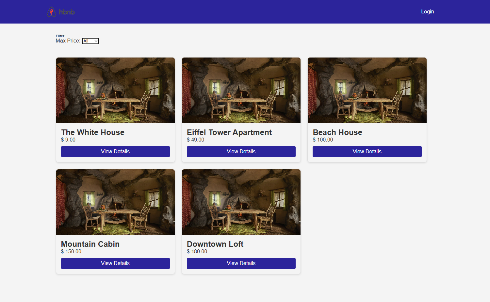
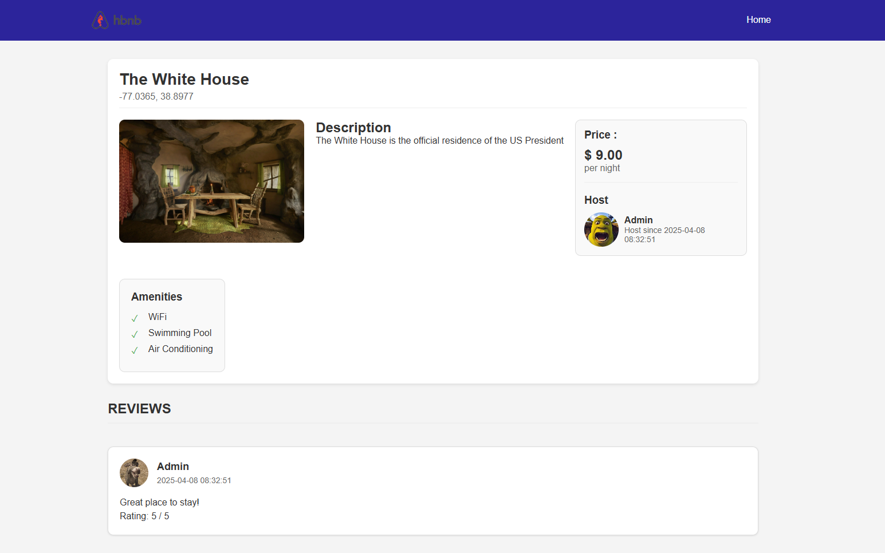

# AirBnB Clone - Part 4: RESTful API

## Overview
This is the fourth part of the AirBnB clone project. In this phase, we're developing a RESTful API that will allow client applications to interact with our application by sending and receiving JSON data.

## Objectives
Develop a user-friendly interface following provided design specifications
Implement client-side functionality to interact with the back-end API
Ensure secure and efficient data handling using JavaScript
Apply modern web development practices to create a dynamic web application

## Features

- User Authentication: Login system with JWT token management
- Places Listing: Display available accommodations with filtering capabilities
- Place Details: Detailed view of each accommodation with images and information
- Reviews System: View and submit reviews for accommodations
- Amenities Display: View amenities associated with each place

## Features
- RESTful API with proper HTTP methods (GET, POST, PUT, DELETE)
- JSON data exchange format
- Authentication and authorization
- Error handling with appropriate HTTP status codes
- Endpoints for all AirBnB objects (User, Place, State, City, Amenity, Review)

## API Endpoint used
POST /api/v1/auth/login: User authentication
GET /api/v1/places: Retrieve all places
GET /api/v1/places/{id}: Get specific place details
GET /api/v1/places/{id}/reviews: Get reviews for a place
POST /api/v1/reviews: Create a new review

## Images of the site running


## Requirements
- Python 3.8+
- Flask
- Flask-RESTful
- SQLAlchemy (or your ORM)
- MySQL or PostgreSQL

## Installation

1. Clone the repository:
```bash
git clone https://github.com/yourusername/holbertonschool-hbnb.git
cd holbertonschool-hbnb/part4
```


2. Install dependencies:
```bash
pip install -r requirements.txt
```

3. Configure your database settings in `config.py`

4. Start the back-end:
```bash
python3 run.py
```
5. Populate the database:
```
sqlite3 instance/development.db < SQL_Scripts/Initial_data.sql
```
The test admin email is : admin@hbnb.io
                    mdp : admin1234
6. Start the front-end
```bash
# Install http-server if you don't have it
npm install -g http-server

# Run the front-end server
npx http-server -p 5500
```
7. Acces the site:
Go to your browser and copy past the link of the front-end from the npm terminal

## API Endpoints

| HTTP Method | Endpoint | Description |
|-------------|----------|-------------|
| GET | /api/v1/status | Check API status |
| GET | /api/v1/users | List all users |
| GET | /api/v1/users/<user_id> | Get a specific user |
| POST | /api/v1/users | Create a new user |
| PUT | /api/v1/users/<user_id> | Update a user |
| DELETE | /api/v1/users/<user_id> | Delete a user |
| GET | /api/v1/places | List all places |

## To test login feature
To test this feature, insert the admin logs (admin@hbnb.io   admin1234)

## To test review feature
To test this feature, go to a place you dont own (all except The white house) and add a review at the bottom of the page

## Technologies Used
Frontend: HTML5, CSS3, JavaScript ES6
API Communication: Fetch API
Authentication: JWT tokens
Backend: Flask, SQLAlchemy, SQLite
Testing: Compatible with major browsers (Chrome, Firefox, Safari)

## Authors
- Mano Delcourt